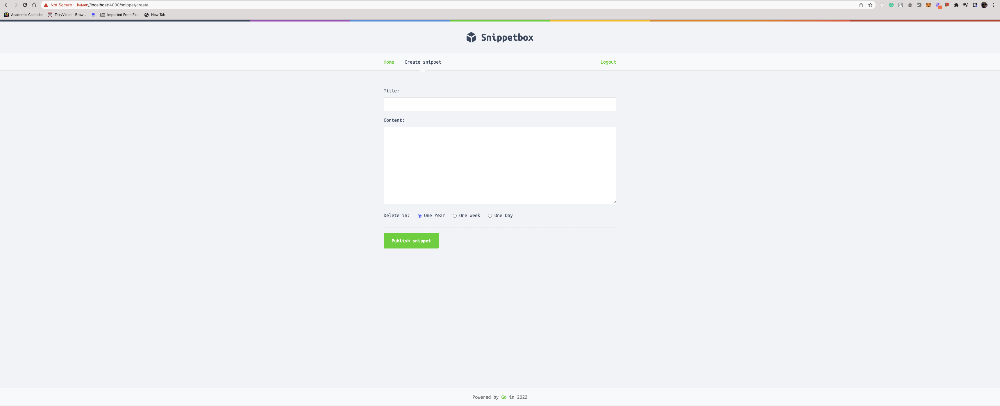

<p align="center">
  
</p>

# Snippetbox

This application was developed by following the [Let's Go book by Alex Edwards](https://lets-go.alexedwards.net/).

It's a full-stack Go web application called Snippetbox that lets people paste and share snippets of text — a bit like GitHub's Gists or Pastebin.

## Features

- Save and view snippets.
- Middleware.
- RESTful routing.
- SSL/TLS web server using HTTP 2.0.
- User authentication. User can signup and login.
- Leveled logging.
- Data persistence using MySQL database.
- Dynamic HTML using Go templates
- Session management
- Web security

## Development

Software requirements:

- This project supports Go modules. Go 1.13+ is required.
- MySQL
- make

To start the local web server with HTTPS on port 4000:

```sh
$ git clone https://github.com/IkehAkinyemi/go-pastebin
$ cd go-pastebin

# Generate TLS key and cert
$ make cert

$ make dev
```

To run the tests, run `make test`.

## Dependencies

This project is all based on the standard library. You don't need a framework to build web applications in Go. Go's standard library contains almost all the tools that you need, even for a moderately complex application. The book teaches you to build web applications using the standard library (rather than using a specific framework like Echo, Chi or Gin). A few small external packages are used where it makes sense for security reasons and to reduce complexity.

## Things I Learned

- Go for web development using just the standard library.
- How to start small and iteratively improve the codebase by refactoring.
- How to structure a project and create testable packages.
- How to create **maintainable** web applications.
- Basic web security.
- How HTTPS works.